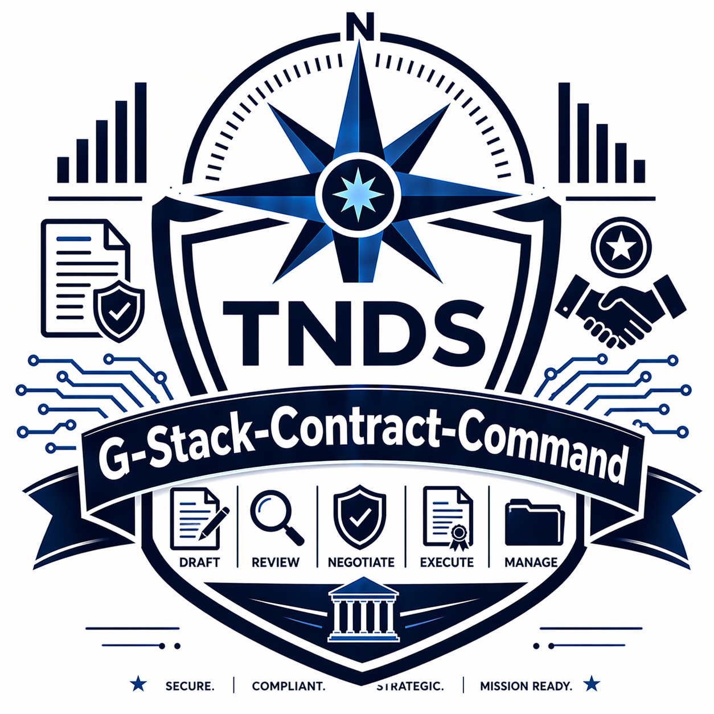

<div align="center">

# Contract Command
### Google Sheets Contract Lifecycle Operations Toolkit

[](https://nodejs.org)
[](LICENSE)
[](https://truenorthstrategyops.com)



</div>

## What this is
Contract Command is a Google Sheets and Apps Script toolkit for managing contract records, renewal windows, and alert workflows from one operational workspace. It is built for repeatable deployment across multiple client environments using placeholder-based configuration.

## What it does
- Creates and manages contract records with lifecycle status tracking.
- Tracks expiration and renewal timelines with configurable alert windows.
- Generates summary, renewal, and vendor analysis outputs.
- Provides dashboard and sidebar interfaces for day-to-day operations.
- Supports scripted setup for branded, client-specific deployment.

## How it works
```text
User in Google Sheet
        |
        v
 Apps Script UI (menu/sidebar/dialog)
        |
        v
 Core logic in Code.gs
        |
        +--> Contracts sheet CRUD
        +--> Alerts Log + reminder dispatch
        +--> Reports + dashboard data
        |
        v
 Optional setup.js bootstrap for new deployments
```

## Quick start
```bash
# 1) Install Node dependencies if needed for your environment
node -v

# 2) Run setup wizard from repo root
node setup.js

# 3) Follow prompts to generate a client-specific deployment package
# 4) Deploy with clasp in the generated output directory
```

## Project structure
```text
contract-command/
  Code.gs
  config.gs
  FunctionRunner.gs
  Tests.gs
  TestRunner.gs
  AddContract.html
  Sidebar.html
  Dashboard.html
  appsscript.json
  setup.js
  README.md
```

## License
MIT. See [LICENSE](LICENSE).

## Support

Questions, bugs, or deployment help: [jacob@truenorthstrategyops.com](mailto:jacob@truenorthstrategyops.com) | 719-204-6365

## Built by
Jacob Johnston | True North Data Strategies LLC | SDVOSB
